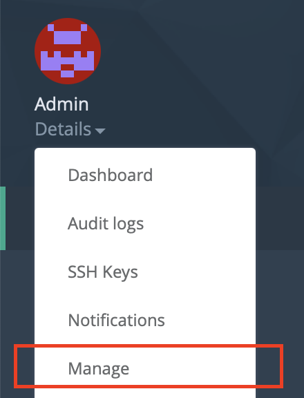

# Authentication

Puhuri Core exposes REST API for all of its operations. Below are examples of typical operations performed against APIs.
To run the examples, we are using a [HTTPie](https://httpie.org/).

Almost all of the operations with API require an authentication token. Below we list two methods on how to get it.

## Authentication with username/password
If your account is allowed to use username/password and the method is enabled (e.g. in dev environment), you can get a new token by submitting a username/password as JSON to a specific endpoint.

<!-- {generate_username_password_authentication} -->

```bash
$ http -v POST https://puhuri-core-beta.neic.no/api-auth/password/ username=admin password=puhuridemoadmin
POST /api-auth/password/ HTTP/1.1
User-Agent: HTTPie/2.4.0
Accept-Encoding: gzip, deflate
Accept: application/json, */*;q=0.5
Connection: keep-alive
Content-Type: application/json
Content-Length: 52
Host: puhuri-core-beta.neic.no

{"username": "admin", "password": "puhuridemoadmin"}

HTTP/1.1 200 OK
Date: Fri, 09 Apr 2021 09:28:41 GMT
Content-Type: application/json
Content-Length: 52
Allow: POST, OPTIONS
X-Frame-Options: SAMEORIGIN
Vary: Accept-Language, Cookie
Content-Language: en
Access-Control-Allow-Credentials: true
Access-Control-Allow-Headers: Accept, Accept-Encoding, Authorization, Content-Type, Origin, User-Agent, X-CSRFToken, X-Requested-With
Access-Control-Allow-Methods: DELETE, GET, OPTIONS, PATCH, POST, PUT
Access-Control-Allow-Origin: *
Access-Control-Expose-Headers: Link, X-Result-Count
Strict-Transport-Security: max-age=31536000; preload
X-Content-Type-Options: nosniff
X-XSS-Protection: 1; mode=block
Referrer-Policy: no-referrer-when-downgrade
Content-Security-Policy: report-uri csp.hpc.ut.ee; form-action 'self';

{"token":"787de6b7c581ab6d9d42fe9ec12ac9f1811c5811"}
```

## Authentication Token management

You are also able to get token from the Puhuri Core web interface. Go to user workspace by selecting 'Manage' in the
user drop-down.

{: style="height:288px;width:220px"}

Scroll down to the Current API token field and click on the 'eye' icon to display the token.


