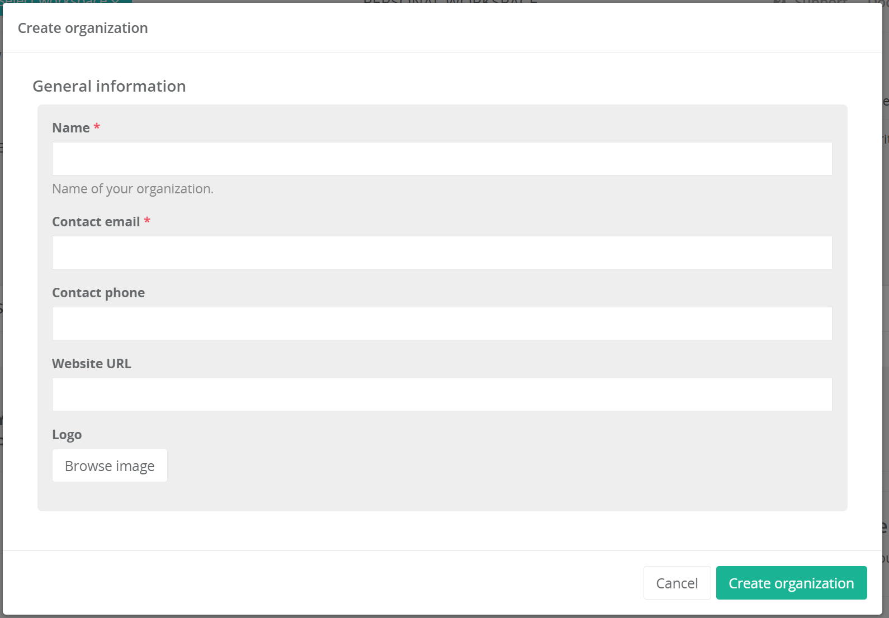

# Organization and project management

!!! warning
    User guide is in development. Early feedback is welcome, send email to ilja.livenson@ut.ee.

## User guide for adding organizations

!!! note
    Organization creation is only allowed for national resource allocator representatives!

Organization in Puhuri Portal context means whatever grouping national resource allocator would like to have.
This can mean for example research group, institution, department or working group. Organization has an owner
who is project principal investigator (PI). National resource allocator can assign owners to organizations.

## Create a new organization 

1. Login to Puhuri Portal using MyAccessID.
   { width="400" }

2. Click on "Select workspace" and then “Add new organization” in the organization selection window.
   
   

3. Fill the form and click "Create organization":
    - Name - Name of the organization
    - Contact email - email of the person, who is responsible for the allocations in that organization
    - Contact phone - contact person’s phone (optional)
    - Website URL - url of the organization (optional)
    - Logo - logo of the organization (optional)
   

## Creation of projects

Project creation is allowed for Principal Investigators (PIs) and Resource Allocators in their organizations.

Prerequisites for creating projects:
    - User must have a Puhuri account (logged in to Puhuri Portal using MyAccessID)
    - Allocator must set PI role to the user in certain organization

1. Login to Puhuri Portal using MyAccessID.
   { width="400" }

2. Select your home organization.
   
   

3. Click on "Add project".
   

4. Fill the necessary fields (fields marked with * are mandatory).

    - Project name - The original title of the project.
    - Project description - A brief description about the project.
    - End date - this is the end date for using the computational resources.
   

## Requesting an allocation

To get an allocation via Puhuri Portal, project participants must first request it.
Request can be initiated by any user, however it must be approved:

 - by PI before being sent to Resource Allocator.
 - by Resource Allocator before being sent to Puhuri Core for processing by the service.

Below is an example of requesting an allocation from LUMI supercomputer:

1. Select "Service catalog" from the sidebar menu and select offering that matches your plans.
   For LUMI, offerings correspond to access types of EuroHPC:
    - Extreme Scale Access
    - Regular Access
    - Benchmark Access
    - Development Access
    - Fast Track Access for Academia
    - Fast Track Access for Industry
  
  
  

2. Write the name for the resource allocation (NOTE: This name will be visible in accounting data.).
   

3. Select correct plan (LUMI common) and write needed allocation quota (CPU, GPU and Storage).

4. Write short description (optional) and choose correct science field (mandatory).

5. Click on the "Add to cart".

6. Check once more and click on "Request an approval" if you not a PI in a project or "Request" if you PI.
   

After this, Resource allocator will request for resource and be able to [approve or reject](project_approval_shared.md) it.
