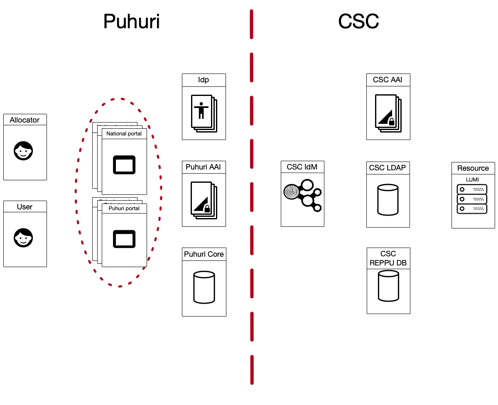

# Integration Guide

A Service Provider (SP) can operate over resources as well as manage resource allocations requested by other organizations.

A typical flow of operations is as follows:
1. Organization representing allocation body creates allocation in a certain project. Allocations are created in 'Creating' state.
2. Service provider polls for new allocations and users with access to them, processes them and marks allocations as approved or rejected. Service provider also reports to Puhuri Core local username created for the user accounts as well as local references to allocations.
3. Service provider regularly reports back accounting data as well as can provide status report for allocation (a semi-structured report visible to end-users).  

[SDK Guide](SDK guide/resource-allocation-management-sp.md) provides description for resource allocation management methods performed via Python 3 SDK for Puhuri Core.

## LUMI Use-case

TODO: Add interactions between components.

{ align=right }
